# SDE 2/3 System Design Master Notes

Welcome to your comprehensive System Design master guide. These notes are constructed linearly from your playlist but have been significantly expanded with **SDE 2 / SDE 3 level depth**, including real-world trade-offs, architecture diagrams, missing concepts relevant for 2026, and common interview questions.

---

## Video 1: System Design Primer ⭐️: How to start with distributed systems?

### 1. Core Concepts Covered
The video introduces system design through the analogy of a pizza parlor:
*   **Vertical Scaling:** Giving one chef (server) more resources (CPU, RAM).
*   **Pre-computing/Batch Processing:** Making pizza bases at 4 AM is equivalent to cron jobs or asynchronous batch processing during off-peak hours (e.g., calculating daily analytics).
*   **Fault Tolerance (Master-Slave):** Having a backup chef in case the main chef falls sick (Active-Passive or Primary-Replica setup).
*   **Horizontal Scaling & Microservices:** Hiring more chefs and grouping them by specialties (garlic bread vs. pizzas) represents horizontal scaling and decoupling into microservices.
*   **Geo-Distribution:** Opening new shops in different areas reduces latency for local users (similar to Edge Computing or CDNs).
*   **Load Balancing:** A central manager routing orders based on wait times (Load Balancer routing via algorithms like Least Connections).
*   **Decoupling:** Separating the delivery agents from the kitchen so they can be scaled and replaced independently (Message Queues, Pub/Sub).

### 2. SDE 2/3 Depth & Missing Topics (2026 Focus)
While the pizza parlor is a great SDE 1 analogy, an SDE 2/3 must discuss the **hidden complexities** of distributed systems:

> [!WARNING] 
> **The Fallacies of Distributed Computing**
> The video assumes the "delivery agent" or the "manager" always communicates perfectly. In reality, networks partition and fail. As a senior engineer, you must mention **Timeouts, Retries with Exponential Backoff, and Circuit Breakers**.

*   **Stateless vs. Stateful:** When scaling horizontally (multiple chefs), the servers should ideally be *stateless*. If the garlic bread chef remembers a custom order but crashes, the state is lost. You must externalize state to a distributed cache (Redis/Memcached) or database.
*   **Auto-scaling Policies:** In modern cloud environments (AWS/GCP), we don't just "hire more chefs"; we use Kubernetes (K8s) Horizontal Pod Autoscalers (HPA) based on CPU/Memory or custom metrics (e.g., queue length).

### 3. Architecture Diagram

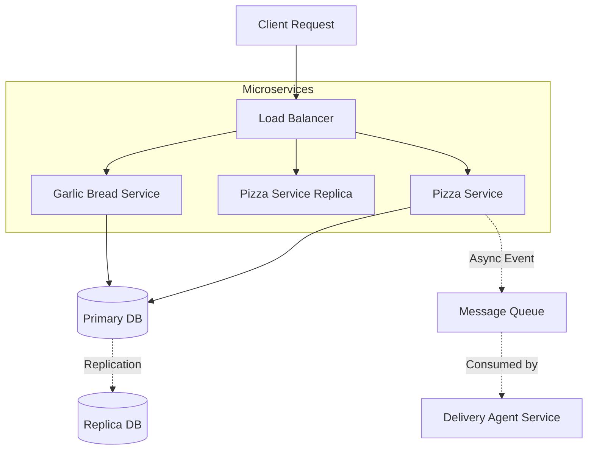
```mermaid
graph TD
    Client[Client Request] --> LB[Load Balancer]
    
    subgraph Microservices
        LB --> ServiceA[Pizza Service]
        LB --> ServiceA_2[Pizza Service Replica]
        LB --> ServiceB[Garlic Bread Service]
    end
    
    ServiceA --> DB_Primary[(Primary DB)]
    ServiceB --> DB_Primary
    DB_Primary -. Replication .-> DB_Replica[(Replica DB)]
    
    ServiceA -. Async Event .-> MQ[Message Queue]
    MQ -. Consumed by .-> DeliveryService[Delivery Agent Service]
```

### 4. Interview Questions
*   **Q:** *If we horizontally scale the pizza chefs, how do we ensure a user's multi-step order goes to the same chef if they need local context?*
    *   **Answer:** You'd use **Sticky Sessions** at the load balancer level (using consistent hashing on the user ID). However, as an SDE 2/3, I would push back against this design and argue for making the chefs stateless by storing the session data in a low-latency cache like Redis.
*   **Q:** *How do you handle the "backup chef" (Primary-Replica) failover without dropping requests?*
    *   **Answer:** Implement health checks. When the primary fails, a consensus algorithm (like Raft/Paxos via ZooKeeper or etcd) elects the replica. During the election window, requests might fail, so clients must implement idempotent retries.

---

## Video 2: System Design BASICS: Horizontal vs. Vertical Scaling

### 1. Core Concepts Covered
*   **APIs & The Cloud:** Exposing code over the internet via APIs running on remote servers (Cloud vs. Desktop).
*   **Vertical Scaling (Scale Up):** Buying a bigger machine (more CPU/RAM).
    *   *Pros:* No network latency (Inter-Process Communication is fast), inherently strong data consistency, no load balancer needed.
    *   *Cons:* Hardware limits (you can only buy a server so big), single point of failure.
*   **Horizontal Scaling (Scale Out):** Buying more machines.
    *   *Pros:* Highly resilient (no single point of failure), scales almost infinitely (linearly).
    *   *Cons:* Requires a load balancer, introduces network latency (Remote Procedure Calls), data consistency becomes a massive headache.
*   **Hybrid Approach:** Use horizontal scaling but optimize each node vertically up to a cost-effective point.

### 2. SDE 2/3 Depth & Missing Topics (2026 Focus)

> [!IMPORTANT]
> **CAP Theorem & Data Consistency**
> The video briefly mentions data consistency in horizontal scaling. As a senior, you must immediately map this to the **CAP Theorem** and **PACELC Theorem**. When you have multiple machines, you are forced into network partitions (P). You must choose between Availability (A) and Consistency (C). 

*   **IPC vs. RPC Costs:** The video notes RPC is slower than IPC. An SDE 3 should know *how to optimize RPCs*. Mention using **gRPC / Protocol Buffers** over HTTP/2 for multiplexed, binary, high-performance network calls instead of standard JSON REST, especially for internal microservice-to-microservice communication.
*   **Distributed Transactions:** The video mentions loose transactional guarantees. You must be able to discuss **Two-Phase Commit (2PC)** (often too slow) vs. the **Saga Pattern** (choreography vs. orchestration) for handling distributed transactions.

### 3. Architecture Diagram: Scaling Evolution

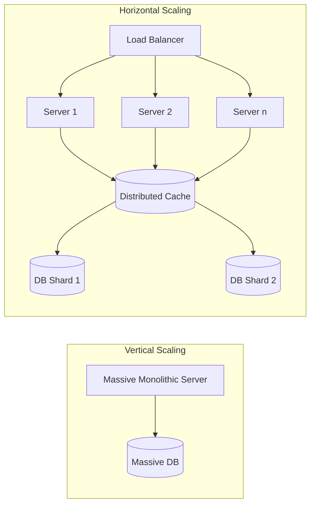
```mermaid
graph LR
    subgraph Vertical Scaling
        VS[Massive Monolithic Server]
        VS_DB[(Massive DB)]
        VS --> VS_DB
    end

    subgraph Horizontal Scaling
        LB[Load Balancer]
        S1[Server 1]
        S2[Server 2]
        S3[Server n]
        LB --> S1 & S2 & S3
        S1 & S2 & S3 --> Cache[(Distributed Cache)]
        Cache --> Shard1[(DB Shard 1)]
        Cache --> Shard2[(DB Shard 2)]
    end
```

### 4. Interview Questions
*   **Q:** *We are hitting the hardware limits of our vertically scaled SQL database. How do we horizontally scale the database?*
    *   **Answer:** First, separate reads from writes using Read Replicas (this horizontally scales reads). If writes are the bottleneck, we must **Shard** the database (horizontal partitioning) based on a shard key (e.g., User ID). We'd use Consistent Hashing to minimize data movement when adding new database nodes.
*   **Q:** *If we use microservices and horizontal scaling, how do we guarantee a transaction spanning three different services succeeds or fails as a whole?*
    *   **Answer:** Standard ACID transactions don't work across databases. I would use the **Saga Pattern**. Each service performs its local transaction and publishes an event. If a downstream service fails, it publishes a failure event, and the upstream services execute **compensating transactions** to undo the work.

---

## Videos 3 & 4: Load Balancing & Consistent Hashing
*(Note: These two videos are deeply interconnected and form a single comprehensive topic)*

### 1. Core Concepts Covered
*   **The Problem with Modulo Hashing:** Hashing requests using `hash(request_id) % N` evenly distributes load. However, if a server is added or removed (`N` changes to `N+1` or `N-1`), nearly every request hashes to a *new* server. This creates a massive cache miss storm and degrades performance entirely.
*   **Consistent Hashing (The Solution):** Instead of an array, use a conceptual "hash ring" (0 to m-1). Both servers and requests are hashed onto this ring. A request is routed to the first server encountered moving *clockwise*.
*   **Node Churn:** When a server is added or removed, only the keys in the immediate clockwise neighborhood are remapped. The expected change in load is exactly `1/N`, drastically reducing cache misses.
*   **Non-uniform Distribution:** Hashing servers randomly can lead to uneven distribution (one server gets a huge gap on the ring, handling too much traffic).
*   **Virtual Nodes (The Fix):** Pass each server through `k` different hash functions (or append suffixes like `S1_A`, `S1_B`). This creates many "virtual nodes" on the ring per physical server, smoothing out the distribution and mitigating hotspots.

### 2. SDE 2/3 Depth & Missing Topics (2026 Focus)

> [!TIP]
> **Implementation in Production**
> You must know how to implement the ring. Use a **Binary Search Tree** (like a Red-Black Tree) or an sorted array combined with **Binary Search** to find the next server in `O(log N)` time.

*   **Data Replication:** In distributed databases (like Cassandra or DynamoDB), you don't just store data on the first clockwise node. To prevent data loss if a node dies, you replicate data to the next `R` nodes clockwise on the ring.
*   **Heterogeneous Environments:** If you have servers with varying capacities (e.g., 32GB vs 128GB RAM), you use **Weighted Virtual Nodes**. Assign proportionally more virtual nodes to the more powerful servers so they naturally absorb a larger section of the ring.
*   **Rendezvous Hashing (HRW):** A modern alternative to consistent hashing that provides an even better distribution for certain proxy/caching use cases by computing a score for every `(key, node)` pair and picking the highest score.

### 3. Architecture Diagram: Hash Ring with Virtual Nodes

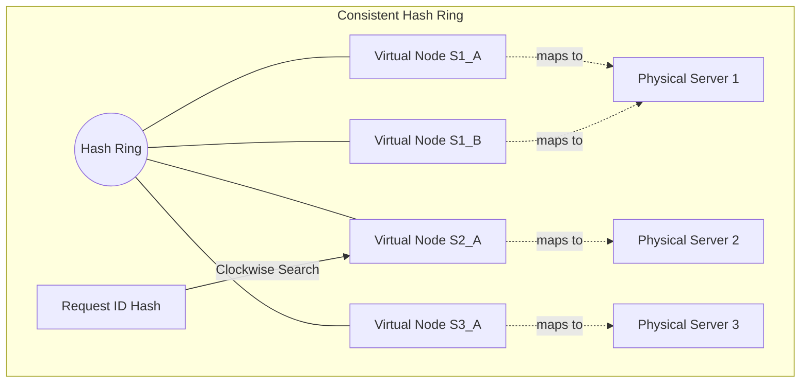
```mermaid
graph TD
    subgraph Consistent Hash Ring
        direction LR
        Ring((Hash Ring))
        
        %% Virtual Nodes mapped to Physical Servers
        Ring --- VN1[Virtual Node S1_A]
        Ring --- VN2[Virtual Node S2_A]
        Ring --- VN3[Virtual Node S1_B]
        Ring --- VN4[Virtual Node S3_A]
        
        VN1 -. maps to .-> S1[Physical Server 1]
        VN3 -. maps to .-> S1
        VN2 -. maps to .-> S2[Physical Server 2]
        VN4 -. maps to .-> S3[Physical Server 3]
        
        Req[Request ID Hash] -->|Clockwise Search| VN2
    end
```

### 4. Interview Questions
*   **Q:** *How do distributed databases like DynamoDB handle consistent hashing under massive scale when a new node is added?*
    *   **Answer:** They use virtual nodes and coordinate via a gossip protocol to share the ring state. When a node is added, it takes over a portion of the ring, and data migration happens asynchronously in the background while the system continues serving reads via quorum consensus.
*   **Q:** *What happens if a server dies and the immediate next server in the consistent hash ring gets overwhelmed by the sudden 2x traffic?*
    *   **Answer:** This is known as a "cascading failure." Using virtual nodes drastically reduces the blast radius because a single physical server is broken into many virtual nodes scattered across the ring. When it dies, its traffic is evenly distributed across many *different* physical servers in the cluster, not just a single neighbor.

---

## Video 5: What is a MESSAGE QUEUE and Where is it used?

### 1. Core Concepts Covered
*   **Asynchronous Processing:** Taking a request (pizza order) and returning an immediate acknowledgment without waiting for the work to finish.
*   **Decoupling:** The client does not need to wait for the server to process the request, freeing up resources on both ends.
*   **Persistence & Reliability:** In a distributed system, holding an in-memory list is dangerous. If the machine loses power, tasks are lost. We persist the queue to a database/message broker.
*   **Heartbeat / Health Checks:** A notifier checks if workers (servers) are alive. If a worker dies while processing a task, the task is reassigned to another healthy worker.
*   **Task Queues vs. Message Queues:** Conceptually similar, they encapsulate persistence, routing, load balancing, and failure retries. Examples include RabbitMQ.

### 2. SDE 2/3 Depth & Missing Topics (2026 Focus)

> [!WARNING]
> **Delivery Semantics & Idempotency**
> The video touches on reassigning tasks if a server crashes. An SDE 2/3 must explicitly talk about **At-Least-Once Delivery**. Because a worker might crash *after* processing a payment but *before* acknowledging the queue, the task will be redelivered. Therefore, your worker logic **MUST be idempotent** (safe to execute multiple times).

*   **Kafka vs. RabbitMQ:** 
    *   *RabbitMQ* is a "smart broker, dumb consumer" push-based model. It tracks message state (acknowledged or not).
    *   *Apache Kafka* is a "dumb broker, smart consumer" pull-based model. It is an append-only distributed log where consumers track their own offsets. Kafka is better for massive throughput and event sourcing.
*   **Dead Letter Queues (DLQ):** If a specific message ("poison pill") contains a bug that consistently crashes the worker, the queue will retry it infinitely, blocking the system. A DLQ catches messages that fail processing `N` times so engineers can inspect them later without blocking the main queue.

### 3. Architecture Diagram: Async Message Queue Processing

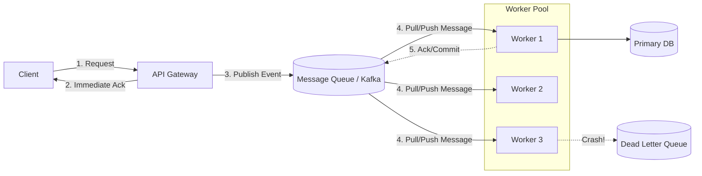
```mermaid
graph LR
    Client -->|1. Request| API[API Gateway]
    API -->|2. Immediate Ack| Client
    API -->|3. Publish Event| MQ[(Message Queue / Kafka)]
    
    subgraph Worker Pool
        W1[Worker 1]
        W2[Worker 2]
        W3[Worker 3]
    end
    
    MQ -->|4. Pull/Push Message| W1 & W2 & W3
    W1 --> DB[(Primary DB)]
    W1 -.->|5. Ack/Commit| MQ
    
    W3 -. Crash! .-> DLQ[(Dead Letter Queue)]
```

### 4. Interview Questions
*   **Q:** *How do you prevent a malformed message from bringing down your entire worker cluster by crashing them one by one in an infinite retry loop?*
    *   **Answer:** Implement a Dead Letter Queue (DLQ). If a message exceeds a maximum retry threshold (e.g., 3 retries), route it to the DLQ. Alerts should trigger on the DLQ for manual developer investigation.
*   **Q:** *What happens if the Message Queue itself goes down?*
    *   **Answer:** For high availability, message queues are deployed as clusters. Kafka uses leader-follower replication for partitions across different brokers. If the leader broker dies, ZooKeeper/KRaft elects a follower as the new leader.

---

## Video 6: What is a MICROSERVICE ARCHITECTURE and what are its advantages?

### 1. Core Concepts Covered
*   **Monolith:** A single cohesive codebase deployed as one unit. It is easy to deploy, great for small teams, requires less setup, and executes fast due to pure in-memory function calls (IPC).
    *   *Disadvantages:* High blast radius (one memory leak takes down the whole app), complicated deployments at scale, steep learning curve for new developers.
*   **Microservices:** Breaking down the system into independent "business units" (e.g., Chat service, Profile service). 
    *   *Advantages:* Independent scaling (you can scale just the Chat service without scaling the Profile service), independent deployments, parallel development for large engineering teams.
    *   *Disadvantages:* Much harder to design, requires a smart architect, network latency (RPCs instead of IPCs), operational complexity.
*   **Rule of Thumb:** If a microservice *only* talks to one other microservice, it probably shouldn't be a microservice.

### 2. SDE 2/3 Depth & Missing Topics (2026 Focus)

> [!IMPORTANT]
> **Domain-Driven Design (DDD)**
> The hardest part of microservices isn't the technology, it's finding the boundaries. An SDE 3 must mention **Bounded Contexts** from Domain-Driven Design to determine where one microservice ends and another begins. 

*   **API Gateways & BFF (Backend for Frontend):** Clients rarely talk to microservices directly. They talk to an API Gateway that handles routing, rate limiting, authentication, and aggregation (solving the "over-fetching/under-fetching" problem).
*   **Service Mesh:** At scale, managing inter-service communication (retries, timeouts, circuit breakers, mutual TLS for security) becomes a nightmare. We use a Service Mesh (like Istio or Linkerd) using sidecar proxies (Envoy) to offload this complexity from the application code.

### 3. Architecture Diagram: Microservices with API Gateway

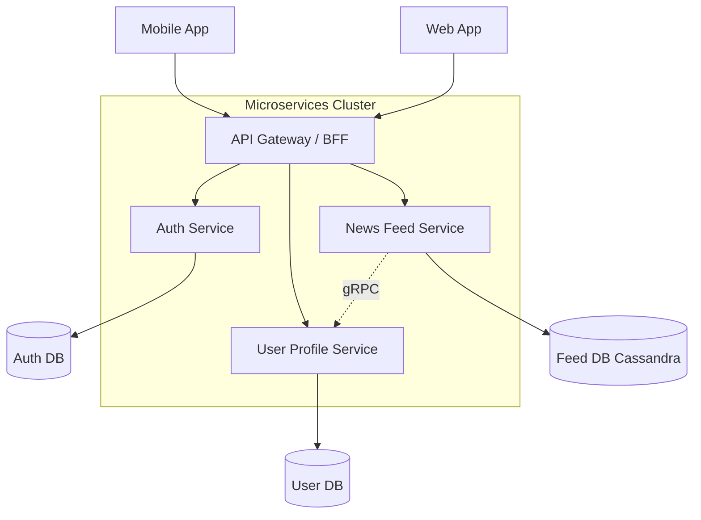
```mermaid
graph TD
    Mobile[Mobile App] --> GW[API Gateway / BFF]
    Web[Web App] --> GW
    
    subgraph Microservices Cluster
        GW --> Auth[Auth Service]
        GW --> User[User Profile Service]
        GW --> Feed[News Feed Service]
        
        Feed -. gRPC .-> User
    end
    
    Auth --> DB_A[(Auth DB)]
    User --> DB_U[(User DB)]
    Feed --> DB_F[(Feed DB Cassandra)]
```

### 4. Interview Questions
*   **Q:** *When would you recommend a Monolith over a Microservice architecture?*
    *   **Answer:** For early-stage startups searching for Product-Market Fit. Microservices introduce a "premium" in operational overhead (CI/CD pipelines, distributed tracing, Kubernetes). Until organizational scale or traffic necessitates it, a well-modularized monolith is highly productive.
*   **Q:** *How do you handle a scenario where Service A calls Service B, but Service B is currently down?*
    *   **Answer:** Implement a **Circuit Breaker pattern**. If Service B fails consecutively, the circuit opens and Service A immediately returns a default/fallback response (or an error) instead of waiting for a network timeout, preventing cascading failures across the system.

---

## Video 7: What is DATABASE SHARDING?

### 1. Core Concepts Covered
*   **Horizontal Partitioning (Sharding):** Splitting a single large database into smaller, faster, more easily managed parts (shards) across multiple servers. 
*   **Shard Key:** A specific attribute (e.g., User ID) used to determine which shard a row of data lives in. 
*   **Master-Slave Replication:** Each shard can have its own master-slave architecture for high availability and fault tolerance.
*   **Problems with Sharding:** 
    *   *Joins:* Doing a SQL `JOIN` across two different shards requires network calls and is extremely slow.
    *   *Inflexibility:* Moving from 4 shards to 5 shards is painfully difficult if data is statically partitioned.
    *   *Hierarchical Sharding:* Dynamically breaking shards into smaller "mini slices" to handle growth.

### 2. SDE 2/3 Depth & Missing Topics (2026 Focus)

> [!WARNING]
> **The Celebrity Problem (Hotspotting)**
> Sharding by User ID sounds great until Justin Bieber (User ID: 1) goes viral. The shard holding User 1 will be overwhelmed with traffic while the other shards sit idle. As a senior, you must know how to handle **Hot Shards**.

*   **Solving Hotspots:** Use a **Compound Shard Key** (e.g., `User_ID + Post_ID`) or append a random suffix to heavily accessed keys to distribute the celebrity's data across multiple shards. 
*   **Consistent Hashing for Shards:** To solve the inflexibility of adding/removing shards, modern NoSQL databases (Cassandra, DynamoDB) use Consistent Hashing to dynamically partition data across nodes. 
*   **Global Secondary Indexes (GSI):** If you shard by `User_ID` but need to query by `City`, the query must fan-out to all shards (Scatter-Gather). To optimize this, you build a GSI: an entirely separate index sharded by `City`.

### 3. Architecture Diagram: Database Sharding

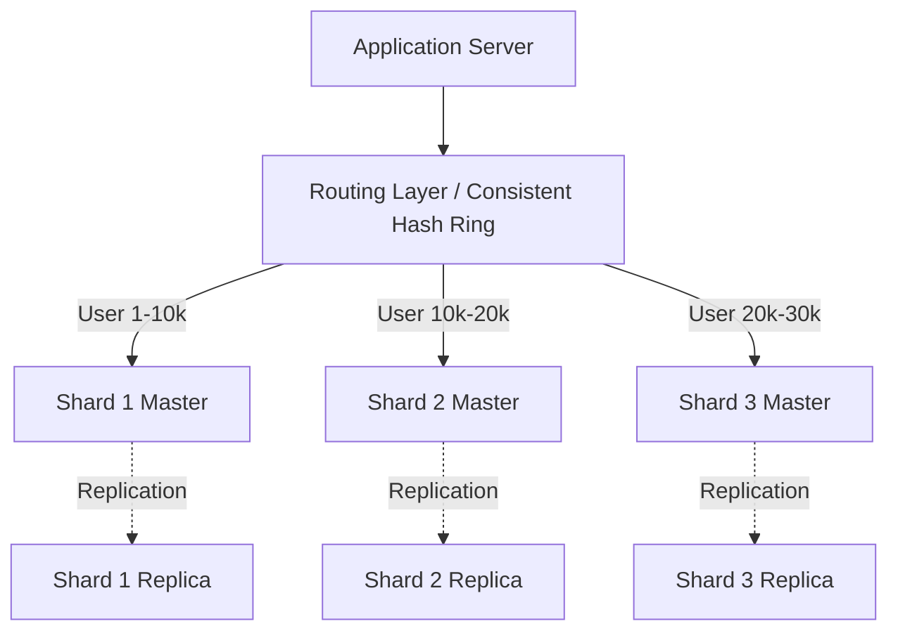
```mermaid
graph TD
    App[Application Server] --> Router[Routing Layer / Consistent Hash Ring]
    
    Router -->|User 1-10k| Shard1[Shard 1 Master]
    Router -->|User 10k-20k| Shard2[Shard 2 Master]
    Router -->|User 20k-30k| Shard3[Shard 3 Master]
    
    Shard1 -. Replication .-> S1_Replica[Shard 1 Replica]
    Shard2 -. Replication .-> S2_Replica[Shard 2 Replica]
    Shard3 -. Replication .-> S3_Replica[Shard 3 Replica]
```

### 4. Interview Questions
*   **Q:** *How do you choose a shard key for a globally used messaging app like WhatsApp?*
    *   **Answer:** You want to minimize cross-shard queries. If users primarily message people in their own country, sharding by `Region/Country` might work, but risks hotspotting (e.g., India shard overloading). Sharding by `Chat_ID` or a hash of the `User_ID` ensures perfectly even distribution, though it might require scatter-gather for some edge case queries.
*   **Q:** *How do you perform a transaction that updates tables residing on two different shards?*
    *   **Answer:** Cross-shard ACID transactions are notorious for destroying performance. You can use Two-Phase Commit (2PC), but it locks databases and has poor latency. The better approach is application-level **Eventual Consistency** using the **Saga Pattern** or Outbox Pattern.

---

## Video 8: Caching in Distributed Systems

### 1. Core Concepts Covered
*   **The Goal of Caching:** Reducing repeatable work through storage. Instead of executing the same heavy database query (e.g., getting a newsfeed), you compute it once, store it in memory (cache), and return that for subsequent identical requests.
*   **Latency Savings:** A full backend trip might take 200ms, while a cache hit takes 2ms.
*   **Hit Ratio:** Since you can't fit terabytes of database data into RAM, you only store the *most frequently accessed* data. The percentage of requests served by the cache is the hit ratio.
*   **Eviction Policies:** When the cache is full, what do you kick out? Common algorithms include Least Recently Used (LRU) and Least Frequently Used (LFU).
*   **Cache Placement:** Caches can be placed on the client, in the application server (in-memory), integrated into the database, or deployed as a Global Distributed Cache (e.g., Redis).

### 2. SDE 2/3 Depth & Missing Topics (2026 Focus)

> [!IMPORTANT]
> **Cache Stampede (Thundering Herd)**
> The video briefly mentions a cache miss resulting in a DB call. But what if a highly popular key (like the Super Bowl score) expires? A thousand concurrent requests will all see a cache miss and simultaneously query the database, crashing it instantly. SDE 2/3s solve this using **Request Coalescing** (only one request queries the DB while the others wait) or **Probabilistic Early Expiration**.

*   **Cache Write Policies:**
    *   *Write-Around:* Data is written straight to the DB, bypassing the cache. Good if data isn't read immediately after writing.
    *   *Write-Through:* Data is written to the cache and the DB simultaneously. Adds write latency but ensures strict consistency.
    *   *Write-Back (Write-Behind):* Data is written only to the cache and asynchronously flushed to the DB. Extreme performance, but risks data loss if the cache crashes.
*   **Cache Invalidation:** As Phil Karlton said, "There are only two hard things in Computer Science: cache invalidation and naming things." Eventual consistency means clients might see stale data. Strict invalidation requires pub/sub mechanisms.

### 3. Architecture Diagram: Distributed Cache

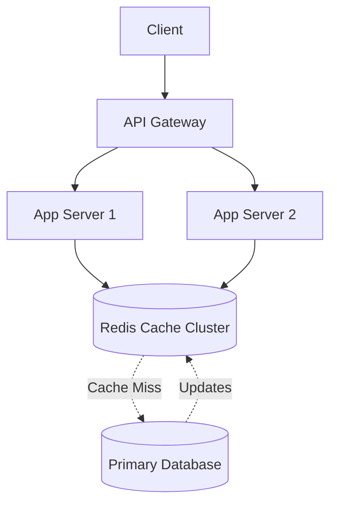
```mermaid
graph TD
    Client --> API[API Gateway]
    API --> App1[App Server 1]
    API --> App2[App Server 2]
    
    App1 --> Cache[(Redis Cache Cluster)]
    App2 --> Cache
    
    Cache -. Cache Miss .-> DB[(Primary Database)]
    DB -. Updates .-> Cache
```

### 4. Interview Questions
*   **Q:** *How do you handle cache invalidation for a high-traffic e-commerce site where the price of an item drops during a flash sale?*
    *   **Answer:** A time-to-live (TTL) is too slow for a flash sale. I would use a pub/sub system (like Kafka or Redis Pub/Sub). When the price changes in the DB, an event is published that explicitly deletes or updates the key in the cache immediately.
*   **Q:** *What happens if your Redis cluster runs out of memory?*
    *   **Answer:** Redis will rely on its configured `maxmemory-policy`. If it's set to `allkeys-lru`, it will evict the least recently used keys. If it's `noeviction`, write operations will fail.

---

## Video 9: How to avoid a single point of failure (SPOF)

### 1. Core Concepts Covered
*   **Definition of SPOF:** A component of a system that, if it fails, will stop the entire system from working.
*   **Redundancy:** The primary way to eliminate SPOFs is to add more nodes (backups or active clones). 
*   **Database Redundancy:** Master-Slave architecture. If the master dies, a slave is promoted to master.
*   **Load Balancers & DNS:** A single load balancer is a SPOF. You must use multiple load balancers, and DNS must be configured to return multiple IP addresses for your domain.
*   **Geo-Redundancy:** If an entire data center goes down (e.g., natural disaster), you need multi-region deployments to survive.

### 2. SDE 2/3 Depth & Missing Topics (2026 Focus)

> [!WARNING]
> **Correlated Failures**
> Adding redundancy doesn't help if both nodes fail for the same reason. If both of your redundant servers are plugged into the same power switch, that switch is your SPOF. In AWS, you must spread redundant nodes across different **Availability Zones (AZs)**.

*   **Active-Active vs. Active-Passive Failover:**
    *   *Active-Passive:* The backup server sits idle until the primary fails. Wastes resources but avoids consistency conflicts.
    *   *Active-Active:* Both servers handle traffic. Requires complex state synchronization and conflict resolution (e.g., CRDTs or Vector Clocks).
*   **Chaos Engineering:** Netflix famously uses Chaos Monkey to randomly terminate production instances to ensure the system is genuinely resilient and failovers happen automatically.
*   **Floating IPs / VRRP:** For load balancer redundancy, two LBs share a "Floating IP" via VRRP (Virtual Router Redundancy Protocol). If the active LB dies, the passive LB assumes the IP address instantly.

### 3. Architecture Diagram: SPOF Elimination

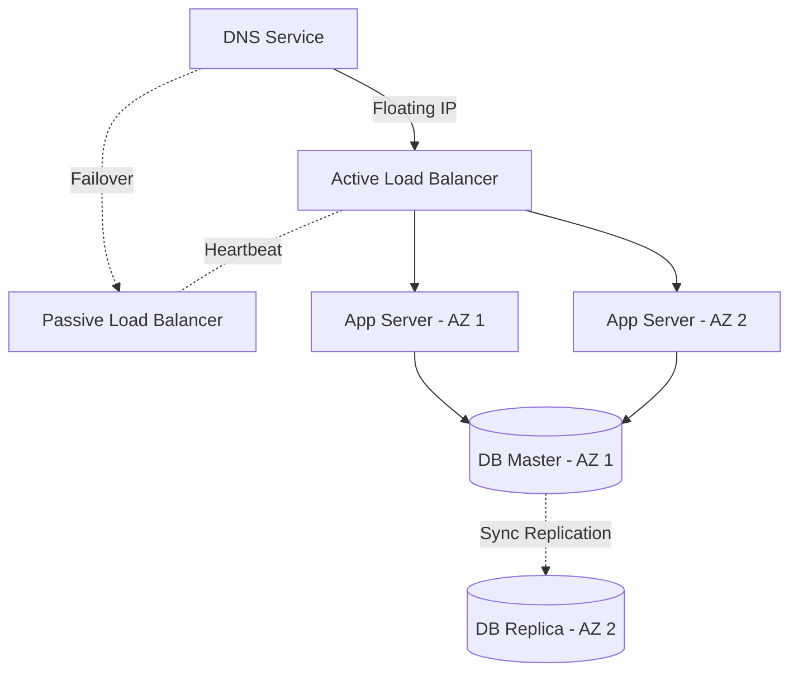
```mermaid
graph TD
    DNS[DNS Service] -->|Floating IP| LB_Active[Active Load Balancer]
    DNS -. Failover .-> LB_Passive[Passive Load Balancer]
    
    LB_Active -. Heartbeat .- LB_Passive
    
    LB_Active --> App_AZ1[App Server - AZ 1]
    LB_Active --> App_AZ2[App Server - AZ 2]
    
    App_AZ1 --> DB_Master[(DB Master - AZ 1)]
    App_AZ2 --> DB_Master
    
    DB_Master -. Sync Replication .-> DB_Replica[(DB Replica - AZ 2)]
```

### 4. Interview Questions
*   **Q:** *If you have an Active-Active multi-region database setup, how do you handle split-brain scenarios where the network between regions is severed?*
    *   **Answer:** If the network partitions, both regions might think the other is dead and start accepting conflicting writes. To prevent split-brain, you need a consensus algorithm (like Raft/Paxos) with an odd number of nodes (typically 3 regions) so that a strict quorum can be established.
*   **Q:** *Are stateless services truly immune to SPOFs?*
    *   **Answer:** Stateless services are immune to *data loss*, but if the auto-scaler relies on a single configuration server that goes down, or if they all rely on a single external API (like a payment gateway), that dependency is a SPOF.

---

## Video 10: What is a CDN (Content Delivery Network)?

### 1. Core Concepts Covered
*   **The Latency Problem:** If your server is in India, clients in the US will experience high network latency (due to the speed of light and fiber optic routes).
*   **The CDN Solution:** A globally distributed network of proxy servers (Edge Nodes). CDNs cache static content (HTML, CSS, JS, images, videos) physically closer to the user.
*   **Data Sovereignty:** CDNs can help comply with local laws (e.g., GDPR) by caching and serving specific content only within specific geographic borders.
*   **Offloading the Origin:** By caching static assets, the main application servers (the "Origin") are spared from massive traffic loads, making the system cheaper to run.
*   **Examples:** Akamai, Cloudflare, Amazon CloudFront.

### 2. SDE 2/3 Depth & Missing Topics (2026 Focus)

> [!TIP]
> **Dynamic Site Acceleration (DSA)**
> CDNs aren't just for static images anymore. Modern CDNs use DSA to accelerate dynamic API calls by routing traffic over highly optimized, dedicated private network backbones rather than the public internet.

*   **Push vs. Pull CDNs:**
    *   *Pull CDN:* The edge node pulls the file from the origin server upon the first user request (cache miss). Best for heavy traffic with diverse content.
    *   *Push CDN:* You proactively upload files to the CDN before users request them. Best for smaller sites with infrequent updates.
*   **Anycast IP Routing:** How does a user connect to the "closest" CDN server? CDNs use Anycast routing, where multiple edge servers around the world share the *exact same IP address*. The BGP routing protocol naturally routes the user's packets to the topologically nearest server.
*   **Cache-Control Headers:** Engineers control the CDN via HTTP headers like `Cache-Control: max-age=3600` and `ETag`.

### 3. Architecture Diagram: CDN Routing

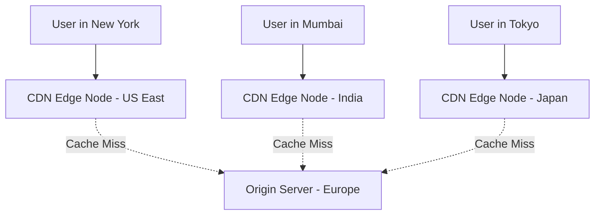
```mermaid
graph TD
    User_US[User in New York] --> Edge_US[CDN Edge Node - US East]
    User_IN[User in Mumbai] --> Edge_IN[CDN Edge Node - India]
    User_JP[User in Tokyo] --> Edge_JP[CDN Edge Node - Japan]
    
    Edge_US -. Cache Miss .-> Origin[Origin Server - Europe]
    Edge_IN -. Cache Miss .-> Origin
    Edge_JP -. Cache Miss .-> Origin
```

### 4. Interview Questions
*   **Q:** *How do you update an image on a website immediately if the CDN has cached it with a 7-day TTL?*
    *   **Answer:** You use **Cache Busting**. Instead of naming the file `logo.png`, you hash the file contents and name it `logo_a1b2c3.png`. When the image changes, the HTML references the new filename, bypassing the CDN cache entirely.
*   **Q:** *Can a CDN protect against DDoS attacks?*
    *   **Answer:** Yes. Because CDNs have massive global bandwidth and operate as a reverse proxy, they can absorb network-layer (Layer 3/4) DDoS attacks. For Layer 7 attacks, modern CDNs integrate Web Application Firewalls (WAFs) to filter malicious payloads.

---

## Video 11: What is the Publisher Subscriber Model?

### 1. Core Concepts Covered
*   **Tight Coupling Problem:** In synchronous Request/Response, if Service A depends on Service B, and Service B is slow or down, Service A must wait or fail. This cascades failures up to the client.
*   **Pub/Sub (Fire and Forget):** Service A (Publisher) drops a message into a Message Broker and immediately returns success to the client. The Broker takes responsibility for delivering it to Service B and Service C (Subscribers).
*   **Scalability:** Adding a new service (Service D) that needs to know about the event requires zero code changes in Service A. You just subscribe Service D to the broker.
*   **Guarantees:** Provides "at-least-once" delivery guarantees. The message broker persists messages until subscribers acknowledge they successfully processed them.

### 2. SDE 2/3 Depth & Missing Topics (2026 Focus)

> [!WARNING]
> **Distributed Transactions & Idempotency**
> A massive flaw in basic Pub/Sub is dealing with financial transactions. If Service B processes a payment but crashes before acknowledging the broker, the broker will replay the message. Service B *must* use **Idempotency Keys** to prevent charging the user twice. Furthermore, rolling back a distributed transaction requires implementing the **Saga Pattern**.

*   **The Outbox Pattern:** What happens if Service A updates its own database, but crashes *before* publishing the event to Kafka? The system is inconsistent. The Outbox Pattern solves this by saving the event to a database table within the same ACID transaction as the state change, then a separate process (like Debezium) tails the database log and reliably publishes it to the broker.
*   **Fan-out Architectures:** Pub/Sub is the foundation for Fan-out, commonly used in News Feed generation (e.g., Twitter).

### 3. Architecture Diagram: Pub/Sub Decoupling

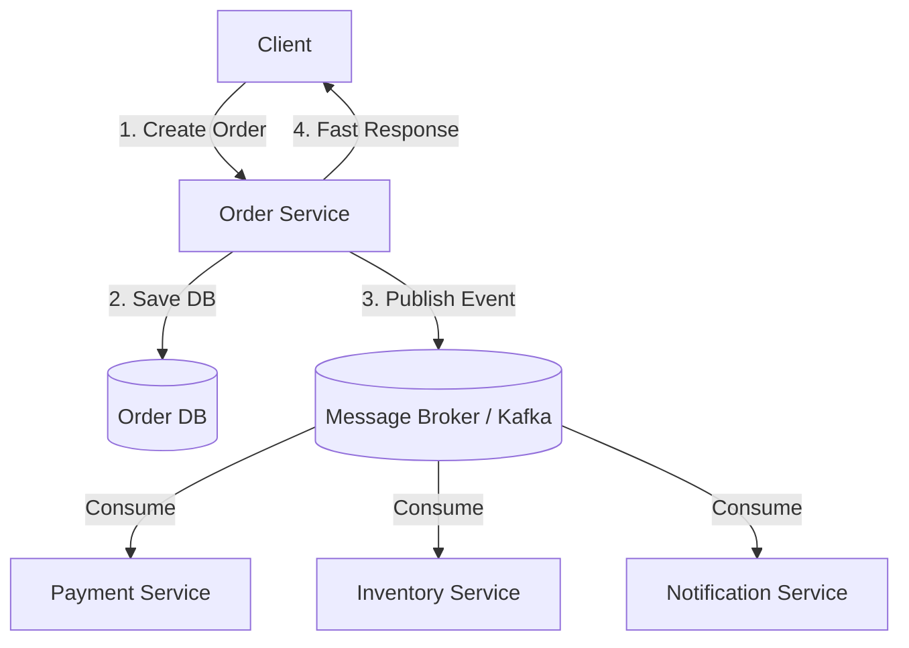
```mermaid
graph TD
    Client -->|1. Create Order| Order[Order Service]
    Order -->|2. Save DB| DB[(Order DB)]
    Order -->|3. Publish Event| Kafka[(Message Broker / Kafka)]
    Order -->|4. Fast Response| Client
    
    Kafka -->|Consume| Pay[Payment Service]
    Kafka -->|Consume| Inv[Inventory Service]
    Kafka -->|Consume| Notif[Notification Service]
```

### 4. Interview Questions
*   **Q:** *If two instances of the Notification Service are running, how do you prevent both from sending the same welcome email when an event is published?*
    *   **Answer:** You configure both instances to be in the same **Consumer Group** in Kafka (or use a queue in RabbitMQ). The broker ensures that a single message is only delivered to one consumer within a consumer group.
*   **Q:** *Why is Pub/Sub dangerous for highly consistent financial systems?*
    *   **Answer:** Because it is fundamentally asynchronous and eventually consistent. If step 1 succeeds but step 2 fails asynchronously, the user sees a success message but the money transfer failed. You must build complex compensating workflows to handle failures gracefully.

---

## Video 12: What's an Event Driven System?

### 1. Core Concepts Covered
*   **Events as State:** Instead of a database storing the *current state* of an object (e.g., `balance = $100`), an event-driven system stores the *log of events* that led to that state (e.g., `deposited $50`, `deposited $100`, `withdrew $50`).
*   **Time-Travel Debugging:** Because you have a pristine, immutable log of every event that ever happened, you can "replay" events from the beginning of time to recreate the state at any arbitrary point in history.
*   **Local Persistence:** Subscribers don't just process events; they often store them in their own local databases, creating highly available, localized read models.
*   **Examples:** Git (commits are events), React (state changes), Node.js (event loop), and Gaming (First Person Shooter movement interpolation and lag compensation).

### 2. SDE 2/3 Depth & Missing Topics (2026 Focus)

> [!IMPORTANT]
> **Event Sourcing and CQRS**
> The formal architectural pattern for this is **Event Sourcing**, often paired with **CQRS (Command Query Responsibility Segregation)**. SDE 3s must articulate that writing events (Commands) and reading state (Queries) have fundamentally different scaling profiles and should often use entirely different databases.

*   **Compaction / Snapshots:** Replaying 10 years of bank transactions to get the current balance is too slow. Systems take periodic "snapshots" (e.g., calculating the balance at midnight every day). You only replay events that occurred *after* the most recent snapshot.
*   **Side Effects:** Replaying events is great for restoring state, but disastrous if processing an event has an external side effect (like sending an email or charging a credit card). You must design systems to disable side effects during a "replay" phase.

### 3. Architecture Diagram: Event Sourcing & CQRS

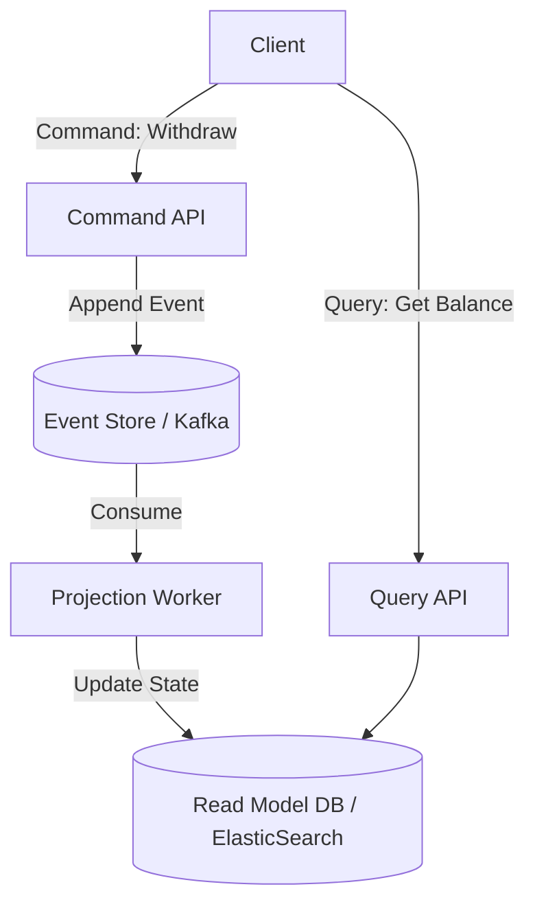
```mermaid
graph TD
    Client -->|Command: Withdraw| API[Command API]
    API -->|Append Event| EventStore[(Event Store / Kafka)]
    
    EventStore -->|Consume| ReadWorker[Projection Worker]
    ReadWorker -->|Update State| ReadDB[(Read Model DB / ElasticSearch)]
    
    Client -->|Query: Get Balance| QueryAPI[Query API]
    QueryAPI --> ReadDB
```

### 4. Interview Questions
*   **Q:** *What is the hardest part about debugging an event-driven microservices architecture?*
    *   **Answer:** Tracing the flow of execution. Because services don't call each other directly (they just emit and react to events), tracing a business workflow from end-to-end requires implementing **Distributed Tracing** (e.g., Jaeger, OpenTelemetry) by passing a unique Correlation ID through all events.
*   **Q:** *How do you change the schema of an event in Event Sourcing if the event is immutable?*
    *   **Answer:** You cannot change historical events. You must use **Event Versioning** (e.g., `UserCreated_v1` vs `UserCreated_v2`) and write "upcasters" in your application code that detect older events and map them into the newer format in memory.

---

## Video 13: Introduction to NoSQL databases

### 1. Core Concepts Covered
*   **Schema-less / Flexible:** Unlike SQL which requires strict columns and expensive `ALTER TABLE` locks, NoSQL stores JSON-like documents (e.g., MongoDB) where each record can have entirely different fields.
*   **No JOINs, High Read Performance:** SQL stores related data across tables (requiring JOINs). NoSQL denormalizes data, storing it all in one giant "blob" (e.g., User + Address + Orders). Fetching the blob is a blazing fast single read.
*   **Horizontal Scalability:** Relational databases are notoriously hard to scale horizontally. NoSQL databases are built from the ground up to be distributed across many cheap commodity servers using consistent hashing.
*   **Cassandra Architecture:** It uses a peer-to-peer ring (masterless) with data partitioned by hash keys. It uses a replication factor to copy data to multiple nodes.

### 2. SDE 2/3 Depth & Missing Topics (2026 Focus)

> [!WARNING]
> **BASE vs. ACID**
> SQL guarantees **ACID** (Atomicity, Consistency, Isolation, Durability). NoSQL generally follows **BASE** semantics (Basically Available, Soft state, Eventual consistency). You cannot use NoSQL for strict financial transactions where multi-row rollback guarantees are required.

*   **Distributed Consensus (Quorum):** In masterless systems like Cassandra, how do we know a read is accurate? We use Quorum (`R + W > N`). If the Replication Factor (N) is 3, we might require 2 nodes to acknowledge a write (W=2) and 2 nodes to agree on a read (R=2). Since 2+2 > 3, the read is mathematically guaranteed to intersect with a node that saw the latest write.
*   **LSM Trees & SSTables:** Under the hood, databases like Cassandra and ElasticSearch are extremely write-optimized because they use Log-Structured Merge Trees. Writes go sequentially to an in-memory MemTable, which periodically flushes to disk as an immutable Sorted String Table (SSTable).
*   **Tombstones:** Because SSTables are immutable, you can't delete data from them. Deletions just write a "Tombstone" marker with a timestamp. Background compaction processes eventually merge files and physically remove the dead data.

### 3. Architecture Diagram: Cassandra Quorum Read/Write

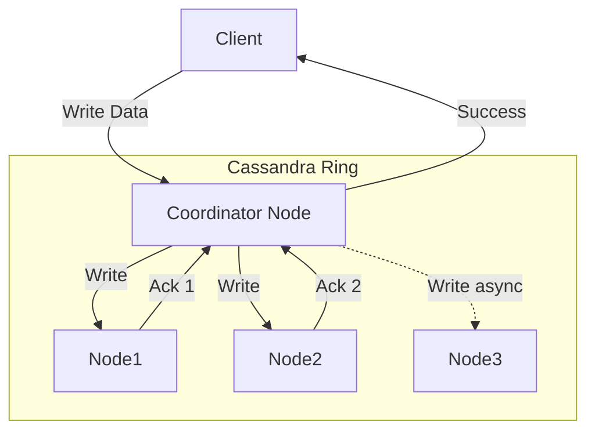
```mermaid
graph TD
    Client -->|Write Data| Coordinator[Coordinator Node]
    
    subgraph Cassandra Ring
        Coordinator -->|Write| Node1
        Coordinator -->|Write| Node2
        Coordinator -.->|Write async| Node3
    end
    
    Node1 -->|Ack 1| Coordinator
    Node2 -->|Ack 2| Coordinator
    
    %% Quorum of 2 reached
    Coordinator -->|Success| Client
```

### 4. Interview Questions
*   **Q:** *Why is Cassandra so fast at writing data but potentially slower at reading?*
    *   **Answer:** Cassandra uses LSM Trees. Writes are simply sequential appends to an in-memory log, which is blazing fast. Reads, however, might have to search through the MemTable and multiple SSTable files on disk to find the most recent version of a key (though this is mitigated by Bloom Filters).
*   **Q:** *If two users update the same NoSQL document at the exact same time on different replica nodes, how is the conflict resolved?*
    *   **Answer:** Cassandra uses Last-Write-Wins (LWW) based on timestamps. Other databases like DynamoDB or Riak might use Vector Clocks to detect the conflict and push it to the application layer to resolve manually.

---

## Video 14: What is an API and how do you design it?

### 1. Core Concepts Covered
*   **APIs as Contracts:** An API (Application Programming Interface) is a documented way for external consumers to interact with your code. It tells them *what* it does, not *how* it does it.
*   **Naming Conventions:** If an API is called `getAdmins`, it should only return admins. It should not return all users or side-load unrelated data. Poor naming creates confusion.
*   **Minimize Extraneous Parameters:** Don't ask for parameters you don't absolutely need. However, passing extra contextual data is sometimes forgivable if it significantly optimizes internal microservice IO calls.
*   **Response Payloads:** Don't stuff responses with data "just in case" the client needs it in the future. Keep payloads small and focused to save network bandwidth.
*   **Error Handling:** Don't define every error under the sun, but also don't use generic `500 Internal Server Error` for everything. Return expected errors (e.g., `404 Group Not Found`).

### 2. SDE 2/3 Depth & Missing Topics (2026 Focus)

> [!WARNING]
> **API Side Effects & Atomicity**
> Never design an API that has unexpected side effects. For example, `setAdmins` should not implicitly *create* a group if one doesn't exist. If an operation requires multiple steps, you must either enforce strict database **Atomicity** or break the API into orchestration steps handled via the **Saga Pattern**.

*   **RESTful Design (HTTP):** Separate the routing from the action. Don't use `POST /getAdmins`. Use standard HTTP verbs: `GET /groups/123/admins`.
*   **Pagination vs. Fragmentation:** If an API returns thousands of records, it will crash the client or timeout.
    *   *Pagination:* Giving control to the client (e.g., `?limit=10&offset=0`). Standard for REST APIs.
    *   *Fragmentation (Chunking):* Sending large responses in internal chunked TCP packets, often used in internal gRPC streams.
*   **GraphQL vs REST:** An SDE 3 should recognize that "stuffing the response" and "over-fetching/under-fetching" are precisely the problems **GraphQL** was invented to solve.

### 3. Architecture Diagram: API Gateway Routing

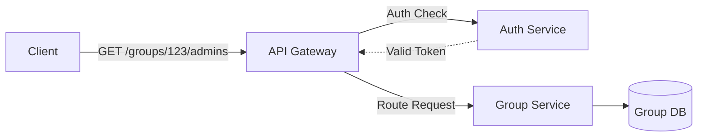
```mermaid
graph LR
    Client -->|GET /groups/123/admins| API_Gateway[API Gateway]
    
    API_Gateway -->|Auth Check| AuthService[Auth Service]
    AuthService -.->|Valid Token| API_Gateway
    
    API_Gateway -->|Route Request| GroupService[Group Service]
    GroupService --> DB[(Group DB)]
```

### 4. Interview Questions
*   **Q:** *You have a REST API returning a list of 10,000 users. Why is offset-based pagination (e.g., `OFFSET 9000 LIMIT 10`) a bad idea for performance?*
    *   **Answer:** In SQL databases, `OFFSET` is highly inefficient because the database still has to scan and discard the first 9,000 rows. A better approach is **Cursor-Based Pagination** (Keyset Pagination), where you pass the last seen ID (e.g., `WHERE id > 9000 LIMIT 10`), which can immediately use an index.
*   **Q:** *How do you version an API when you introduce breaking changes?*
    *   **Answer:** You can use URI versioning (`/v1/users`), query parameters (`?version=1`), or header versioning (`Accept: application/vnd.myapi.v1+json`). URI versioning is the most common and cache-friendly approach.

---

## Video 15: System Design: TINDER as a microservice architecture

### 1. Core Concepts Covered
*   **Core Features:** Storing profiles (including images), Direct Messaging (chatting), Recommending Matches, and Swiping (Noting Matches).
*   **Image Storage (Files vs. Blobs):** Images should be stored in a Distributed File System (DFS) like S3, not as BLOBs in a database. Files are cheaper, inherently immutable (you just replace the file URL), and can be easily served via a CDN. The DB only stores the URL reference.
*   **API Gateway:** Clients talk to a Gateway, not directly to microservices. The Gateway authenticates the token with the Profile Service and then routes the request.
*   **Direct Messaging (Chat):** HTTP is client-to-server (pull-based), which is terrible for chat. You need a push-based protocol. The video suggests XMPP or standard WebSockets. 

### 2. SDE 2/3 Depth & Missing Topics (2026 Focus)

> [!IMPORTANT]
> **Geospatial Recommendation (The Hard Part)**
> Finding users "near me" is the core of Tinder. You cannot index Latitude and Longitude efficiently using standard B-Trees. An SDE 3 must discuss **Geo-hashing** or **Quad-trees**, which convert 2D coordinates into a 1D string, allowing you to find users in adjacent geographical sectors quickly.

*   **Session Management:** To route a chat message, the system must know *which* server the recipient's WebSocket is connected to. You need a **Session Service** (often backed by Redis) mapping `UserID -> WebSocket Server IP`.
*   **Sharding by Location:** To optimize queries, shard the database by geographical region. For example, all users in New York are on Shard A. However, beware of the "border problem" where a user is on the edge of a shard boundary.

### 3. Architecture Diagram: Tinder Core

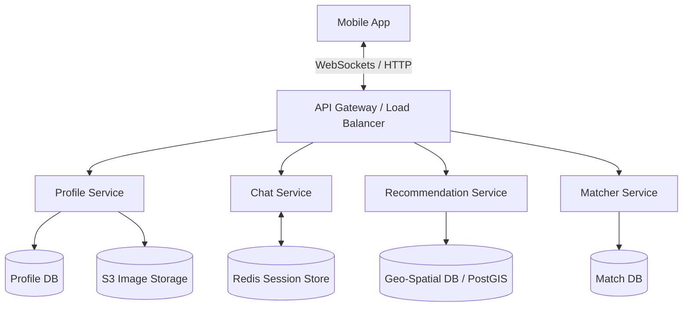
```mermaid
graph TD
    App[Mobile App] <-->|WebSockets / HTTP| Gateway[API Gateway / Load Balancer]
    
    Gateway --> Profile[Profile Service]
    Profile --> ProfileDB[(Profile DB)]
    Profile --> ImageStore[(S3 Image Storage)]
    
    Gateway --> Chat[Chat Service]
    Chat <--> SessionDB[(Redis Session Store)]
    
    Gateway --> Rec[Recommendation Service]
    Rec --> GeoDB[(Geo-Spatial DB / PostGIS)]
    
    Gateway --> Match[Matcher Service]
    Match --> MatchDB[(Match DB)]
```

### 4. Interview Questions
*   **Q:** *How does the system deliver a chat message if the recipient is currently offline?*
    *   **Answer:** The Chat Service attempts to find the recipient in the Redis Session Store. If they are not connected, the message is persisted to a database (like Cassandra) and a push notification is sent via Apple APNs / Google FCM to wake up the recipient's phone.
*   **Q:** *How do you handle the recommendation algorithm when a user travels to a new city?*
    *   **Answer:** The mobile app periodically sends GPS pings. The Recommendation Service updates the user's Geo-hash in the database. When fetching new recommendations, it queries the new Geo-hash bucket (and neighboring buckets).

---

## Video 16: Designing INSTAGRAM: System Design of News Feed

### 1. Core Concepts Covered
*   **Core Features:** Image Storage, Liking/Commenting, Following Users, and Generating a News Feed.
*   **Data Modeling (Likes & Comments):** A `Likes` table should have a `ParentID` and a `Type` (Comment or Post) to allow liking both. Aggregations (like `total_likes`) shouldn't force a `COUNT(*)` query every time; use a separate Activity or Aggregation table updated via triggers or async workers.
*   **News Feed Generation (The Naive Way):** When a user opens the app, query all users they follow, then query all posts by those users, sort by time, and return. This is too slow and will crash the database at scale.
*   **Pre-computation (Fan-Out on Write):** When a user creates a post, the system immediately pushes that post ID into the pre-computed News Feed cache (Redis) of *every single person who follows them*.

### 2. SDE 2/3 Depth & Missing Topics (2026 Focus)

> [!WARNING]
> **The Celebrity Problem (Justin Bieber Effect)**
> If Justin Bieber (100 million followers) makes a post, doing a Fan-Out on Write means doing 100 million cache updates instantly. This will completely overwhelm the queue and Redis clusters.

*   **Hybrid Feed Generation:** 
    *   *Push Model (Fan-out on write):* Used for normal users. Efficient reads.
    *   *Pull Model (Fan-out on read):* Used for celebrities. When you open your feed, the system grabs your pre-computed feed (normal friends) and *merges* it on-the-fly with recent posts from the celebrities you follow.
*   **Feed Caching Strategy:** Store the pre-computed feeds in an in-memory cache like Redis (as a Linked List). Only keep the top ~200 posts per active user. If a user hasn't logged in for a month, evict their feed from the cache and rebuild it the next time they open the app.

### 3. Architecture Diagram: Hybrid News Feed

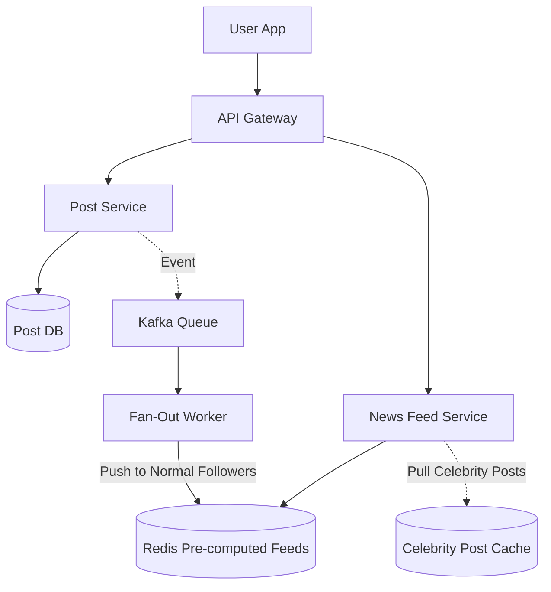
```mermaid
graph TD
    Client[User App] --> Gateway[API Gateway]
    Gateway --> FeedService[News Feed Service]
    
    FeedService --> Redis[(Redis Pre-computed Feeds)]
    
    %% Fan-out on Write Flow
    Gateway --> PostAPI[Post Service]
    PostAPI --> PostDB[(Post DB)]
    PostAPI -.->|Event| Kafka[Kafka Queue]
    
    Kafka --> FanOutWorker[Fan-Out Worker]
    FanOutWorker -->|Push to Normal Followers| Redis
    
    %% Hybrid Pull Flow
    FeedService -.->|Pull Celebrity Posts| CelebCache[(Celebrity Post Cache)]
```

### 4. Interview Questions
*   **Q:** *How do you prevent massive load spikes if a celebrity deletes a post that was already pushed to millions of follower feeds?*
    *   **Answer:** Do not attempt to iterate through millions of Redis lists to delete the post ID. Instead, mark the post as `deleted` in the primary database. When the Feed Service reads the Redis list to serve to a user, it does a hydration step where it fetches the post metadata. If the post is marked deleted, it filters it out dynamically before returning the feed to the client.
*   **Q:** *Why is a NoSQL database (like Cassandra) often preferred over MySQL for storing user News Feeds?*
    *   **Answer:** News feeds are highly write-intensive (constant fan-outs) and require massive horizontal scalability. Cassandra's LSM-Tree architecture is optimized for blazing-fast writes, and its distributed nature easily handles the massive volume of feed data.

---

## Video 17: WHATSAPP System Design: Chat Messaging Systems for Interviews

### 1. Core Concepts Covered
*   **Core Features:** 1-to-1 Chat, Group Messaging, Read Receipts (Sent, Delivered, Read), and Last Seen / Online Status.
*   **Real-time Communication:** HTTP is pull-based and inappropriate for real-time chat. WhatsApp uses **WebSockets** (or custom TCP protocols like XMPP/Erlang based systems) for full-duplex, peer-to-peer communication.
*   **Connection Management:** The API Gateway manages raw TCP connections. It passes messages to a **Sessions Microservice** which acts as a router, keeping track of which UserID is connected to which Gateway box.
*   **Group Chat Routing:** When a message is sent to a group, a Group Service retrieves all members. The Sessions Service then routes the message to each member's respective connected Gateway. Groups are size-limited (e.g., 200 members) to prevent massive fan-out issues on write.
*   **Last Seen Tracking:** Only specific *user activities* (typing, sending a message, opening the app) update the "Last Seen" database. System-level activities (like a background delivery receipt) do not update the last seen timestamp.

### 2. SDE 2/3 Depth & Missing Topics (2026 Focus)

> [!WARNING]
> **Stateful Gateway Servers**
> Unlike typical stateless microservices, WebSocket Gateways are fundamentally **stateful**. If a gateway server crashes, millions of active TCP connections drop instantly. Clients will reconnect, causing a "Thundering Herd" DDOS attack on your own infrastructure. You must implement **Connection Jitter** (randomized reconnect delays) on the client side.

*   **Message Ordering (Vector Clocks):** In group chats, guaranteeing the exact order of messages across distributed systems is impossible using plain timestamps. Systems use sequence numbers or Vector Clocks to ensure clients reconstruct the chat history correctly.
*   **End-to-End Encryption (E2EE):** An SDE 3 must mention the Signal Protocol. The server never sees the plaintext message. The Session service routes encrypted blobs. The server only stores the message in a temporary queue (like Cassandra) until it is delivered, after which it is deleted.
*   **Presence Service at Scale:** Updating a database every time a user comes online is too expensive. We use a **Presence Service** backed by Redis. To avoid hammering Redis, gateways batch online/offline status updates and send them asynchronously.

### 3. Architecture Diagram: WhatsApp Core

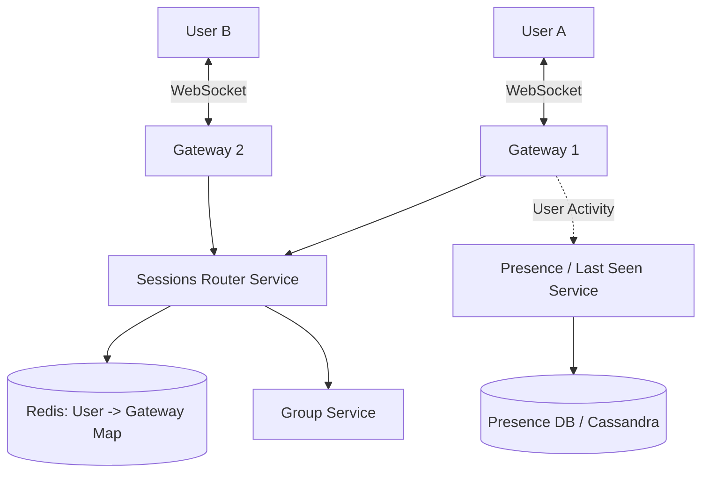
```mermaid
graph TD
    UserA[User A] <-->|WebSocket| GW1[Gateway 1]
    UserB[User B] <-->|WebSocket| GW2[Gateway 2]
    
    GW1 --> Session[Sessions Router Service]
    GW2 --> Session
    
    Session --> Redis[(Redis: User -> Gateway Map)]
    Session --> Group[Group Service]
    
    GW1 -. User Activity .-> Presence[Presence / Last Seen Service]
    Presence --> PresenceDB[(Presence DB / Cassandra)]
```

### 4. Interview Questions
*   **Q:** *How do you handle a scenario where User B is offline and User A sends them a message?*
    *   **Answer:** The Sessions Service won't find User B in the Redis mapping. It will store the encrypted message in a temporary Cassandra table (Message Queue) and trigger a Push Notification (Apple APNs / Firebase FCM) to wake up User B's phone. When User B's phone connects, it pulls pending messages from the queue.
*   **Q:** *If a user sends an image, does it go through the WebSocket?*
    *   **Answer:** No. Sending large binary blobs over WebSockets blocks the single thread handling real-time text messages. Images are uploaded via standard HTTP POST to a Blob Store (S3). The WebSocket only transmits the metadata (the CDN URL of the uploaded image).

---

## Video 18: How NETFLIX onboards new content: Video Processing at scale

### 1. Core Concepts Covered
*   **The Problem:** Different users have different internet speeds and devices (Mobile, 4K TV, Web). A single raw video file cannot serve everyone efficiently.
*   **Video Processing (Encoding/Transcoding):** The raw video is converted into multiple **formats** (Codecs like MP4, AVI) and multiple **resolutions** (1080p, 720p, 480p).
*   **Chunking (Distributed Processing):** Processing a 2-hour movie on one machine is too slow and prone to failure. Netflix breaks the video into small chunks so thousands of processors can encode them in parallel.
*   **Scene-Based Chunking:** Instead of splitting chunks by strict time (e.g., exactly 3 minutes), Netflix splits chunks by **Scene Changes** (shots). This prevents awkward buffering pauses right in the middle of a high-action car chase.
*   **Open Connect (ISP Caching):** Netflix gives specialized server racks (Open Connect Appliances) directly to Internet Service Providers (ISPs) worldwide. These racks pre-cache the most popular movies locally, bypassing the public internet and saving massive bandwidth.

### 2. SDE 2/3 Depth & Missing Topics (2026 Focus)

> [!TIP]
> **Adaptive Bitrate Streaming (ABR)**
> The Netflix player continuously monitors your internet speed. If your Wi-Fi drops, the player seamlessly switches from requesting the 1080p chunk to requesting the 480p chunk. Because chunks are aligned by scenes, the transition is invisible to the user.

*   **Dynamic Packaging:** Modern streaming doesn't actually store a separate MP4 file for every resolution. They store raw encoded video and audio streams separately, and a "Packager" dynamically packages them into formats like HLS or DASH on the fly when requested.
*   **Storage Tiers:** The raw, uncompressed master files (often terabytes per movie) are stored in deep cold storage (AWS S3 Glacier). The encoded chunks for serving are stored in standard S3 and heavily cached at the Edge (Open Connect).
*   **Predictive Fetching:** For highly engaging ("dense") movies, the client player predictively pre-fetches the next few chunks into a buffer. For "sparse" viewing (skipping around), the client only fetches exactly what is requested to save bandwidth.

### 3. Architecture Diagram: Video Processing Pipeline

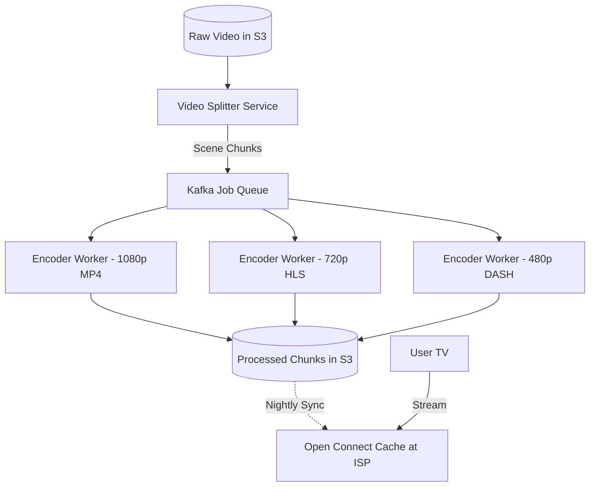
```mermaid
graph TD
    Raw[(Raw Video in S3)] --> Splitter[Video Splitter Service]
    
    Splitter -->|Scene Chunks| Kafka[Kafka Job Queue]
    
    Kafka --> Encoder1[Encoder Worker - 1080p MP4]
    Kafka --> Encoder2[Encoder Worker - 720p HLS]
    Kafka --> Encoder3[Encoder Worker - 480p DASH]
    
    Encoder1 --> Processed[(Processed Chunks in S3)]
    Encoder2 --> Processed
    Encoder3 --> Processed
    
    Processed -. Nightly Sync .-> ISP[Open Connect Cache at ISP]
    User[User TV] -->|Stream| ISP
```

### 4. Interview Questions
*   **Q:** *If an encoder worker crashes halfway through processing a 4-second chunk, what happens?*
    *   **Answer:** Because the work is distributed via a message queue (Kafka), the message is simply not acknowledged. After a timeout, the queue reassigns that specific 4-second chunk to another healthy worker. This requires the encoding task to be fully idempotent.
*   **Q:** *How does Netflix know which movies to proactively push to an ISP's Open Connect box in India vs the US?*
    *   **Answer:** They use predictive analytics based on regional popularity. Every night at 3 AM (off-peak hours), the control plane calculates a "manifest" of the top 1000 movies for India and pushes only those chunks to the Indian ISP racks to maximize the cache hit ratio.

---

## Video 19: Capacity Planning and Estimation: How much data does YouTube store daily?

### 1. Core Concepts Covered
*   **Estimation Strategy:** Start with top-down assumptions. Example: 1 Billion users -> 1/1000 upload daily -> 1 million videos uploaded per day.
*   **Storage Calculations:**
    *   Assume 10 minutes per video.
    *   Estimate size: If a 2-hour movie is ~400MB (highly compressed), then 10 minutes is ~30MB. (The video uses 3MB/min).
    *   Total raw data: 1M videos * 10 mins * 3MB = 30 TB / day.
*   **Replication and Processing Overhead:** 
    *   You don't just store one copy. You need 3x replication for fault tolerance = 90 TB.
    *   You must encode it into multiple resolutions (1080p, 720p, etc.), which roughly doubles the storage requirement = 180 TB (approx 0.2 Petabytes / day).
*   **RAM/Cache Estimations:** Caching thumbnails requires memory. If 10% of videos are "popular", and a thumbnail is 10KB, caching 100 million thumbnails requires ~1 TB of RAM. Distributed across 16GB nodes, you need ~64 nodes.
*   **Throughput Estimations (Processing Power):** Converting daily uploads into MB/second gives you the required processing throughput. Based on read/write/compute times, you can estimate the number of parallel servers required.

### 2. SDE 2/3 Depth & Missing Topics (2026 Focus)

> [!IMPORTANT]
> **The Real Purpose of Capacity Planning**
> In a senior interview, the exact math doesn't matter (you can use round numbers). What matters is that you identify the **bottlenecks**. If your math says you need 1 TB of RAM, you must immediately state: "A single machine can't handle this reliably, so we must shard the cache cluster into 64 nodes."

*   **Network Bandwidth (Egress Costs):** While storage (S3) is relatively cheap, Network Egress (sending video data out to users) is the most expensive part of YouTube. SDE 3s must estimate bandwidth: `Concurrent Users * Bitrate = Required Network Throughput`. This justifies the immense investment in custom CDNs.
*   **IOPS (Input/Output Operations Per Second):** Storing 180 TB is easy. But can the hard drives handle the concurrent read/write speed? Hard Disk Drives (HDDs) have low IOPS, so we must use Solid State Drives (SSDs) or heavy RAM caching for hot data, moving cold data to HDDs later.
*   **Fermi Estimates:** The technique of making justified guesses (like "1 in 1000 users upload") is called a Fermi Estimate. Always state your assumptions loudly so the interviewer can correct you if they prefer a different assumption.

### 3. Architecture Diagram: Storage Tiers

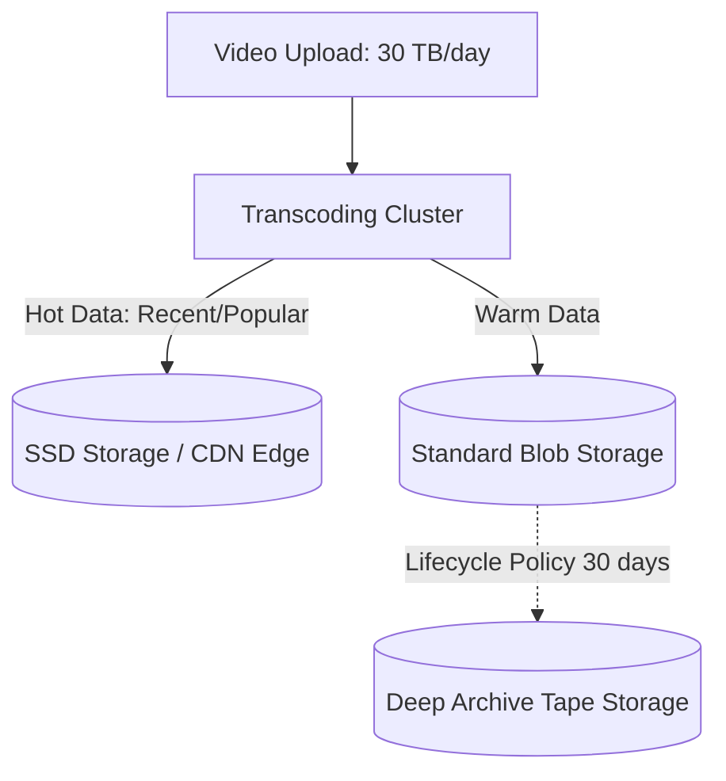
```mermaid
graph TD
    Upload[Video Upload: 30 TB/day] --> Processing[Transcoding Cluster]
    
    Processing -->|Hot Data: Recent/Popular| SSD[(SSD Storage / CDN Edge)]
    Processing -->|Warm Data| S3[(Standard Blob Storage)]
    
    S3 -. Lifecycle Policy 30 days .-> Glacier[(Deep Archive Tape Storage)]
```

### 4. Interview Questions
*   **Q:** *If you calculate that your system requires 10,000 writes per second, what database technology would you choose?*
    *   **Answer:** A standard single-node PostgreSQL database will struggle to exceed 5,000 - 10,000 IOPS reliably without extremely expensive hardware. I would choose a distributed NoSQL database like Cassandra or DynamoDB, which can easily scale horizontally to handle hundreds of thousands of writes per second.
*   **Q:** *You estimated 64 cache nodes (16GB each) are needed. Why is it dangerous to run exactly 64 nodes in production?*
    *   **Answer:** You must plan for peak load and node failures. If one node dies, its traffic moves to the others, potentially causing an out-of-memory cascading failure. You should provision at 50% capacity (i.e., 128 nodes) to ensure the system survives peak traffic and server crashes safely.

---

## Video 20: How databases scale writes: The power of the log ✍️🗒️

### 1. Core Concepts Covered
*   **The Write Bottleneck:** Traditional SQL databases use B+ Trees. While B+ Trees provide excellent $O(\log N)$ read and write time theoretically, writing requires disk seeks, updating internal nodes, and rebalancing the tree. This random I/O makes high-volume writes a major bottleneck.
*   **The Speed of the Log:** If you want the fastest possible write speed, use an append-only log (like a Linked List). The time complexity is $O(1)$ because it's purely sequential I/O (just appending to the end of a file).
*   **The Read Problem:** A pure log is terrible for reading ($O(N)$ sequential scan).
*   **Log-Structured Merge-Trees (LSM-Trees):** A hybrid data structure used by modern NoSQL databases (Cassandra, RocksDB) to get $O(1)$ writes and fast reads. Data is written to an in-memory sorted structure, then flushed to disk as immutable **Sorted String Tables (SSTables)**.
*   **Compaction:** Because flushing creates many small SSTables, reading would require checking all of them. A background process called Compaction continuously merges smaller SSTables into larger ones (using a merge-sort algorithm), purging deleted/overwritten data.
*   **Bloom Filters:** To avoid scanning an SSTable on disk only to find the key isn't there, databases keep an in-memory Bloom Filter. It tells the DB "the key is *definitely not* here" or "the key *might* be here", drastically reducing useless disk reads.

### 2. SDE 2/3 Depth & Missing Topics (2026 Focus)

> [!TIP]
> **MemTables and Write-Ahead Logs (WAL)**
> The video simplifies the in-memory part. An SDE 3 must clarify: To survive a crash before the in-memory array is flushed to an SSTable, every write is *first* appended to a durable **Write-Ahead Log (WAL)** on disk. The WAL is only read during crash recovery. The actual serving of data happens from the in-memory **MemTable**.

*   **Tombstones:** Because SSTables are immutable, you cannot "delete" a row. Instead, you write a new record with a special "Tombstone" marker. During compaction, when the system merges a valid record and a Tombstone, it drops both, physically freeing the space.
*   **Read Amplification vs. Write Amplification:** 
    *   *Read Amplification:* Having to read multiple SSTables to find a value.
    *   *Write Amplification:* The same data being rewritten multiple times during background compaction.
    *   Tuning an LSM database is a constant battle between optimizing for Read vs Write amplification.

### 3. Architecture Diagram: LSM-Tree Write Path

```mermaid
graph TD
    Client -->|Write Key-Value| API[Database Node]
    
    API -->|1. Append (O-1)| WAL[(Write-Ahead Log on Disk)]
    API -->|2. Insert| MemTable[In-Memory MemTable: Red-Black Tree]
    
    MemTable -.->|3. Flush when full| SSTable1[(SSTable Level 0)]
    
    SSTable1 -.->|4. Background Compaction| SSTable2[(SSTable Level 1)]
```

### 4. Interview Questions
*   **Q:** *A user complains that your Cassandra database read latency sporadically spikes. What might be causing this?*
    *   **Answer:** It's likely a poorly tuned Compaction strategy. If compaction falls behind, reads must scan too many SSTables. Conversely, if major compaction kicks in during peak traffic, it starves the CPU and disk I/O, causing read queries to queue up and timeout.
*   **Q:** *How does a Bloom Filter work, and why does it have false positives but no false negatives?*
    *   **Answer:** A key is hashed using multiple hash functions to flip bits in a bit array. To check a key, you check those same bits. If even one bit is 0, the key is definitively *not* there (no false negatives). However, if all bits are 1, the key *might* be there, because other keys could have coincidentally flipped those exact bits (false positive).

---

## Video 21: Distributed Consensus and Data Replication strategies on the server

### 1. Core Concepts Covered
*   **Master-Slave Architecture:** To avoid a Single Point of Failure (SPOF) and scale reads, we replicate databases. A Master takes writes; Slaves take reads and copy data from the Master.
*   **Sync vs. Async Replication:** 
    *   *Synchronous:* Master waits for Slave to acknowledge the copy before returning success. Safe, but slow.
    *   *Asynchronous:* Master returns success immediately and copies to Slave in the background. Fast, but risks data loss if Master dies.
*   **Master-Master & Split Brain:** If two nodes accept writes, network failures can cause them to become isolated. They both think they are the leader and accept conflicting writes. When the network heals, you have a Split Brain problem (conflicting state).
*   **Quorum & Consensus:** To prevent Split Brain, you need an odd number of nodes (e.g., 3). If a partition happens, the side with the majority (Quorum) continues accepting writes; the minority halts. This requires Distributed Consensus.
*   **Saga Pattern & MVCC:** 
    *   *MVCC (Multi-Version Concurrency Control):* Keeps old versions of data so reads aren't blocked by writes (used in Postgres).
    *   *Saga:* For long-running distributed transactions (like food ordering), don't lock databases. Break it into local transactions and use compensating actions (rollbacks) if a step fails.

### 2. SDE 2/3 Depth & Missing Topics (2026 Focus)

> [!WARNING]
> **Raft and Paxos**
> The video glosses over *how* consensus is achieved. As an SDE 2/3, you must know that systems like ZooKeeper, etcd, and Kafka use **Raft** or **Paxos** algorithms. They rely on Leader Election and an Append-Entries log to ensure the cluster agrees on the sequence of state changes.

*   **Vector Clocks (Conflict Resolution):** In masterless systems (like DynamoDB), if a split-brain occurs and two conflicting writes happen, the database doesn't crash. It uses Vector Clocks (e.g., `[NodeA:2, NodeB:1]`) to detect the conflict and pushes both versions to the client application to resolve programmatically (e.g., merging shopping carts).
*   **Two-Phase Commit (2PC):** A strong consistency protocol for distributed transactions across multiple databases. 
    *   *Phase 1 (Prepare):* Coordinator asks all DBs to lock rows and prepare to commit.
    *   *Phase 2 (Commit):* If all say yes, coordinator says "commit." If one says no, coordinator says "rollback." It's incredibly slow and a blocking protocol, hence Sagas are preferred.

### 3. Architecture Diagram: Split Brain & Quorum

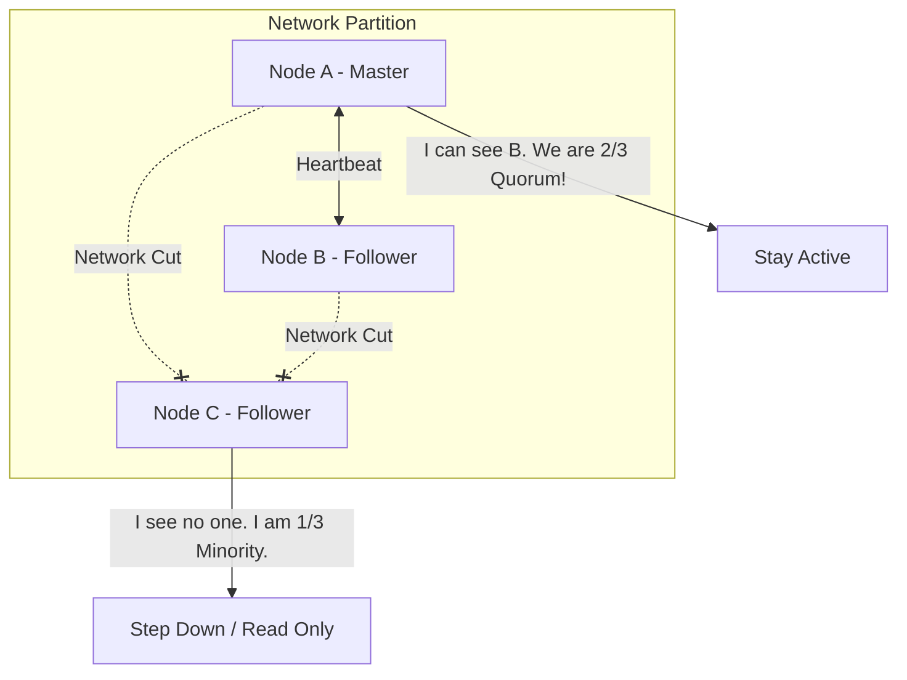
```mermaid
graph TD
    subgraph Network Partition
        NodeA[Node A - Master]
        NodeB[Node B - Follower]
        NodeC[Node C - Follower]
        
        NodeA <-->|Heartbeat| NodeB
        NodeA -.-x|Network Cut| NodeC
        NodeB -.-x|Network Cut| NodeC
    end
    
    NodeA -->|I can see B. We are 2/3 Quorum!| Active[Stay Active]
    NodeC -->|I see no one. I am 1/3 Minority.| Halt[Step Down / Read Only]
```

### 4. Interview Questions
*   **Q:** *Why is a Two-Phase Commit (2PC) considered an anti-pattern in high-throughput microservices?*
    *   **Answer:** 2PC holds strict database locks across multiple independent services while waiting for network acknowledgments. If the coordinator crashes during Phase 2, the locks remain held indefinitely. It fundamentally violates the independence and availability required in microservices.
*   **Q:** *If you are designing a highly available shopping cart service, would you prefer synchronous or asynchronous replication?*
    *   **Answer:** Asynchronous. Availability is prioritized over strict consistency (AP in CAP theorem). If a node dies and a user loses an item they just added to their cart, it's a minor annoyance. If synchronous replication causes the "Add to Cart" button to take 5 seconds or fail, you lose revenue.

---

## Video 22: Designing a location database: QuadTrees and Hilbert Curves

### 1. Core Concepts Covered
*   **The Proximity Problem:** Given a massive map, finding "users within 5km" using pure Euclidean math requires scanning every user in the database (which is $O(N)$ and too slow).
*   **Geohashing (Grid Partitioning):** Dividing the map using binary coordinates (e.g., bitwise latitude/longitude). This reduces search space, but a user on the border of a grid cell might be very close to a user in the adjacent cell, even though their binary prefixes look entirely different.
*   **QuadTrees:** A 2D tree where each node represents a bounding box. If a box contains too many users, it recursively splits into 4 smaller quadrants. It allows fast spatial querying but suffers from tree-rebalancing complexities when users move constantly.
*   **Space-Filling Curves (Z-Curve & Hilbert Curve):** The genius solution is to convert the 2D map into a 1D line using fractal curves. 
    *   Because 1D lines are easy to index (using B-Trees), we can map 2D coordinates to a 1D integer.
    *   *The Hilbert Curve* is preferred over the Z-Curve because it better preserves **spatial locality**: points close to each other on the 2D map are highly likely to be close to each other on the 1D Hilbert line.

### 2. SDE 2/3 Depth & Missing Topics (2026 Focus)

> [!IMPORTANT]
> **Read-Heavy vs. Write-Heavy Spatial Systems**
> QuadTrees are excellent for relatively static data (like finding restaurants). However, for a ride-sharing app where thousands of cars update their location every second, modifying a QuadTree is an absolute nightmare due to constant locking and node splitting. 
> For highly dynamic systems, **Redis Geospatial Indexes** (which under the hood use Geohashes mapped to Sorted Sets) are the industry standard.

*   **Geohash Edge Cases:** The "edge problem" happens when two points are physically 1 meter apart but lie on opposite sides of the Prime Meridian or Equator; their geohashes will share zero prefix bits. Queries must always check the target grid *plus its 8 neighboring grids* to guarantee accuracy.
*   **S2 Geometry & H3 (Uber):** SDE 3s must mention modern alternatives. 
    *   *Google S2:* Maps the sphere to a cube, using Hilbert curves on the cube faces. Fast and highly precise.
    *   *Uber H3:* Uses an **Hexagonal Grid System**. Unlike squares, hexagons are equidistant to all neighbors, making radius approximations and smoothing algorithms mathematically perfect for ride routing.

### 3. Architecture Diagram: Geospatial Indexing

```mermaid
graph LR
    App[Uber App] -->|Lat/Long: 40.7, -74.0| API[Location Service]
    
    API -->|1. Convert| S2[H3/Geohash Library]
    S2 -->|2. Hex Index: 892a10...| Cache[(Redis GeoHash Sorted Set)]
    
    Cache -->|3. ZRANGEBYLEX| API
    API -->|4. Return Nearby Drivers| App
```

### 4. Interview Questions
*   **Q:** *If you are designing Uber, how do you store the real-time locations of drivers moving every 3 seconds?*
    *   **Answer:** Do not use a persistent disk-based database like Postgres/PostGIS for real-time location pinging; it will burn out the disks. Use an in-memory datastore like Redis. You update the driver's Geohash in a Redis Sorted Set. A background worker can asynchronously bulk-persist the location history to an OLAP database for analytical purposes.
*   **Q:** *Why did Uber switch from Geohashes (rectangles) to H3 (hexagons) for surge pricing algorithms?*
    *   **Answer:** Rectangles have two types of neighbors: edge neighbors and vertex neighbors, which have different distances from the center. Hexagons have only one type of neighbor, all exactly equidistant. This makes calculating smoothed surge pricing gradients across a city computationally trivial and uniform.

---

## Video 23: Data Consistency and Tradeoffs in Distributed Systems

### 1. Core Concepts Covered
*   **The Single Server Problem:** A single database server suffers from Single Point of Failure (SPOF), hard limits on Vertical Scaling, and high network latency for global users.
*   **The Consistency Challenge:** Once you replicate data across global servers to fix latency and SPOF, you introduce the problem of keeping the data copies perfectly in sync (Consistency).
*   **Two-Phase Commit (2PC):** A strong consistency protocol for distributed transactions across multiple databases.
    *   *Phase 1 (Prepare):* Leader asks followers to lock rows and prepare to commit.
    *   *Phase 2 (Commit/Rollback):* If all acknowledge, leader sends Commit. If anyone fails or times out, leader sends Rollback.
*   **Availability vs. Consistency:** 2PC locks resources. While waiting for network acknowledgments, reads and writes on those rows are blocked. The system becomes perfectly consistent but highly unavailable.
*   **Eventual Consistency:** In most modern web applications, blocking users is unacceptable. We accept that replicas might temporarily show stale data, as long as they *eventually* synchronize.

### 2. SDE 2/3 Depth & Missing Topics (2026 Focus)

> [!TIP]
> **CAP Theorem vs. PACELC Theorem**
> As a senior engineer, the CAP theorem is often too simplistic. You should discuss **PACELC**: *If there is a Partition (P), how does the system trade off Availability and Consistency (A and C); Else (E), when the system is running normally, how does it trade off Latency and Consistency (L and C)?*

*   **Read-Your-Own-Writes Consistency:** A specialized form of eventual consistency. If a user updates their profile picture, they should instantly see the new picture, even if the rest of the world sees the old one for a few minutes. Achieved by routing the user's subsequent reads to the Master node or caching locally.
*   **Quorum Reads/Writes:** In systems like Cassandra, you can tune consistency per request using $W + R > N$. (Write Quorum + Read Quorum > Total Replicas). This guarantees strong consistency without locking the entire database like 2PC.

### 3. Architecture Diagram: 2PC vs Eventual Consistency

```mermaid
graph TD
    subgraph Strict Consistency - 2PC
        L1[Leader DB] -->|1. Prepare| F1[Follower DB]
        F1 -->|2. ACK| L1
        L1 -->|3. Commit| F1
        F1 -.-x|Locked during 1-3| User[User Read - BLOCKED]
    end
    
    subgraph Eventual Consistency
        L2[Leader DB] -->|Async Replication| F2[Follower DB]
        L2 -.->|Instant Response| Client
        F2 -->|Read Stale Data| User2[User Read - FAST]
    end
```

### 4. Interview Questions
*   **Q:** *Why is a Two-Phase Commit (2PC) considered a bad fit for microservices?*
    *   **Answer:** Microservices are supposed to be independently deployable and highly available. 2PC creates tight temporal coupling; if a downstream billing service is slow to acknowledge, the upstream checkout service locks up. We use the Saga pattern instead.
*   **Q:** *How do you implement "Read-Your-Own-Writes" in an eventually consistent system?*
    *   **Answer:** When the user makes a write, we return an updated version token. The client passes this token on subsequent reads. If the replica being read hasn't caught up to that version token yet, the request is routed to the leader node or the replica waits.

---

## Video 24: System Design Interview: TikTok Architecture

### 1. Core Concepts Covered
*   **Requirements & Scale:** Designing a short-video platform (TikTok/Reels). 10M DAU, 100K Creators. Highly read-heavy system. Latency for upload can be minutes, but latency for viewing must be milliseconds.
*   **Database Choices:**
    *   *User Data:* MySQL (Relational) for structured profiles and ACID compliance.
    *   *Video Metadata:* NoSQL (MongoDB/DynamoDB) for flexible schema (tags, variable attributes) and massive read scaling.
    *   *Video Files:* Object Storage (AWS S3) combined with a CDN (Akamai/Cloudfront) for global distribution.
*   **Asynchronous Video Processing (Ingestion Pipeline):**
    *   Uploading a large video blocks the client. Instead, the upload is pushed to a Queue.
    *   Workers pull the video, chunk it, and parallelize the processing.
    *   The video is encoded into multiple formats (MP4, WebM) and resolutions (1080p, 720p, 480p) simultaneously by different workers.
*   **CDN Caching:** Viewers don't stream from S3. The Video Serving Service returns metadata with CDN URLs. The client streams directly from the nearest Edge node.

### 2. SDE 2/3 Depth & Missing Topics (2026 Focus)

> [!IMPORTANT]
> **Adaptive Bitrate Streaming (ABR)**
> Senior candidates must mention ABR (like HLS or DASH). You don't just send an MP4 file. The video is broken into 2-second `.ts` (Transport Stream) segments. The client continuously monitors network bandwidth and dynamically requests the next 2-second segment in either 1080p or 480p depending on real-time network conditions.

*   **Upload Optimization (Multipart Upload):** For uploading, SDEs should mention parallel chunked uploads. If a user is uploading a 50MB file and fails at 49MB, they shouldn't restart. Use S3 Multipart Upload to upload chunks in parallel and retry only failed chunks.
*   **Pre-fetching for Infinite Scroll:** TikTok's magic is zero buffering. The client downloads the metadata for the next 10 videos and pre-fetches the first 1-2 seconds of each video into local mobile cache while you are watching the current video.

### 3. Architecture Diagram: Video Ingestion & Delivery

```mermaid
graph LR
    Creator -->|1. Upload| API[API Gateway]
    API -->|2. Put Event| Queue[Kafka/SQS]
    
    subgraph Async Processing
        Queue --> W1[Worker - 1080p]
        Queue --> W2[Worker - 720p]
        Queue --> W3[Worker - 480p]
        W1 --> S3[(AWS S3)]
        W2 --> S3
        W3 --> S3
    end
    
    S3 -->|3. Push to Edge| CDN[CDN Edge Nodes]
    CDN -->|4. Stream Segments| Viewer
```

### 4. Interview Questions
*   **Q:** *In your TikTok design, how do you handle a viral video that suddenly gets 10 million views in an hour?*
    *   **Answer:** The CDN naturally absorbs this, but the *metadata* database (MongoDB) might get crushed by reads for likes/comments. We would put a Redis cache in front of the metadata DB. For likes/view counts, we wouldn't write to DB instantly; we'd aggregate counts in memory (or Redis) and flush to the DB periodically to save write IOPS.
*   **Q:** *Why split the video into multiple resolutions instead of letting the mobile phone downscale it?*
    *   **Answer:** Sending a 1080p video to a phone on a 3G network wastes massive amounts of bandwidth (costing money) and causes buffering. Providing a native 480p file saves network transit time and drastically reduces CPU decoding strain on low-end devices, saving battery life.

---

## Video 25 & 26: 5 Tips for System Design Interviews & HLD vs LLD

### 1. Core Concepts Covered
*   **Do Not Go Into Detail Prematurely:** Don't start defining TCP vs UDP or writing DB schemas in the first 5 minutes. Outline the High-Level boxes first, wait for the interviewer's feedback, and then dive deep where asked.
*   **Don't Have a Set Architecture in Mind:** Don't force every problem into a Kafka Pub/Sub model or Microservices just because you read a blog. Listen to the requirements.
*   **Keep It Simple, Stupid (KISS):** Don't overengineer with complex heartbeat servers or specific analytics databases unless the interviewer explicitly requests those features.
*   **Justify Your Choices:** Don't just say "I'll use Cassandra." Say "I'll use Cassandra because it's a masterless architecture that provides high availability and fast writes, which perfectly matches our massive write-heavy telemetry requirement."
*   **Be Aware of Technologies:** Know the landscape. Don't invent terms. Use industry standards: API Gateway, Kafka, Redis, S3, Cassandra, Postgres.
*   **HLD vs LLD:** 
    *   *High Level Design (HLD):* Focuses on architecture, load balancers, database choices, replication, queues.
    *   *Low Level Design (LLD):* Focuses on code, object-oriented design, Class Diagrams, Design Patterns (Strategy, Factory, Observer), and APIs.

### 2. SDE 2/3 Depth (2026 Focus)

> [!NOTE]
> **The Interview is a Conversation, Not a Presentation**
> For SDE 3 / Staff roles, the interviewer is evaluating if they want to work with you. If you get defensive when they challenge your architecture, it's a red flag. Acknowledge trade-offs: "You're right, introducing Kafka here adds operational complexity, but here is why I think the decoupling benefit outweighs it..."

*   **Capacity Estimation (Back-of-the-envelope):** Senior engineers must ground their designs in math. Don't guess. Estimate QPS, Storage per day, and Network Bandwidth. Use this math to justify whether a component needs horizontal scaling or if a single Redis instance is enough.
*   **Failure Scenarios:** Always dedicate the last 5 minutes to what happens when things break. "What if Redis dies?", "What if the CDN goes down?", "How do we recover from a split-brain?" 

### 3. Interview Framework

```mermaid
graph TD
    A[1. Clarify Requirements] --> B[2. Capacity Estimation]
    B --> C[3. API Design]
    C --> D[4. Data Model]
    D --> E[5. High-Level Design]
    E --> F[6. Deep Dives & Trade-offs]
```

### 4. Final System Design Checklist
*   [ ] Did I ask clarifying questions about Read vs Write ratios?
*   [ ] Did I identify the bottlenecks based on math?
*   [ ] Did I justify my Database choices based on ACID vs BASE?
*   [ ] Did I handle Single Points of Failure (SPOFs)?
*   [ ] Did I communicate trade-offs clearly?

---
